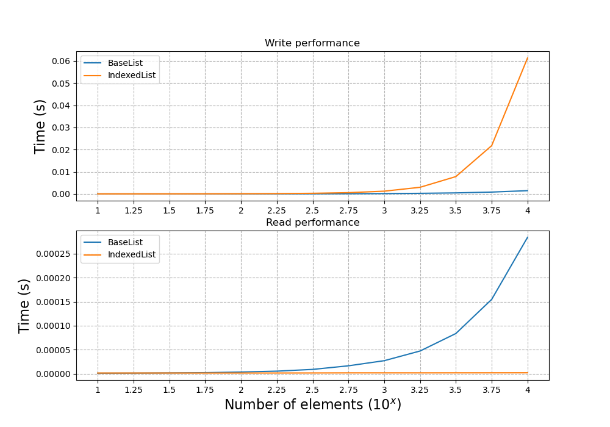

# IndexedList

A python class which maintains an index of values in the list, improving read/query performance.

A complementary class BaseList has been created with similar methods: `add`, `delete`, and `query`. For the BaseList, `add` and `delete` are trivial list methods, while `query` makes use of list comprehensions to filter the results appropriately.

The IndexedList class maintains an index for the list in its `.values` attribute. This index gets updated when the `add`/`delete` methods are called. This leads to slower write performance (`add` and `delete`) but much faster read (`query`) performance.

## Performance results

To test performance, the `timeit` module has been run to test the execution speed of the `add` and `query` methods on lists of varying lengths. The results below are for lists which are randomly sorted (`add` performance is improved if the values are sorted, so this represents a worst-case).

This performance test can be re-run in the `tests/test_performance.py`. Some manual configuration of the `timeit` code is required however.
